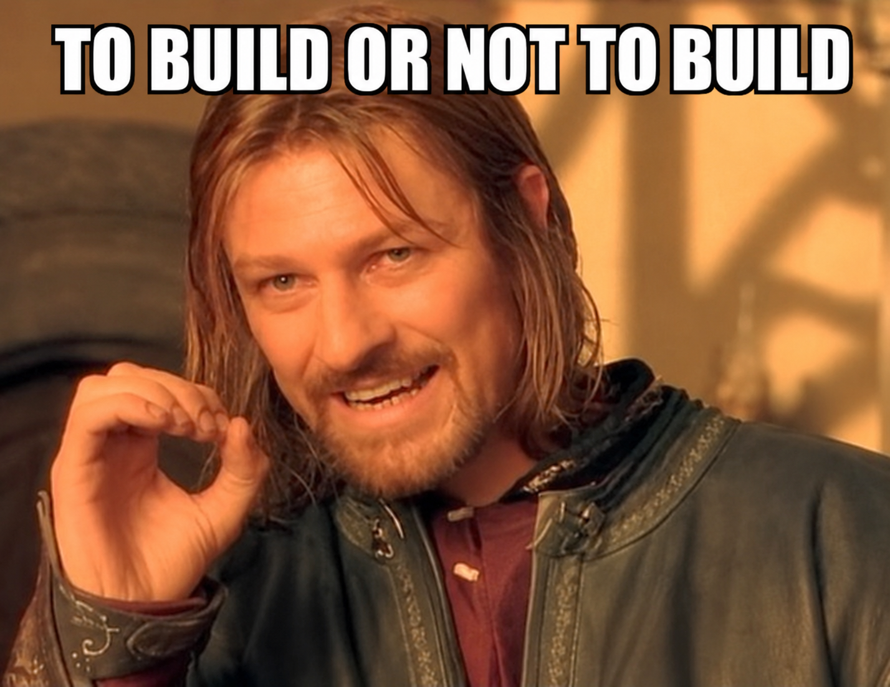

<div align="center">



# FindMeSaaS

### Find the SaaS worth building. Then find out how it dies — before you build it.

**An AI venture analyst that runs in your terminal.** It interviews you, researches the market with real sources, scores your idea across six dimensions, and hands you a verdict with a two-week experiment to test the one assumption most likely to kill it.

It is built to disagree with you.


*Maintained by [Latif Abderrahmane](https://github.com/Latifox)*

**[See two real verdicts →](examples/)**  ·  **[60-second start ↓](#60-second-start)**

**If you have ever asked an AI to generate a million-dollar idea and believed the answer, star this.**

</div>

---

## The problem this exists for

Ask a general chatbot whether your idea is good and it will find a way to say yes. It has no rubric, no memory between steps, no obligation to cite anything, and no mechanism that lets a single fatal flaw outweigh five encouraging paragraphs.

FindMeSaaS is the opposite by construction:

- **Scoring is multiplicative, not additive.** Any dimension below 25 out of 100 multiplies the whole score down. One catastrophic weakness cannot be averaged away by four good ones, because that is not how startups fail.
- **Every claim carries a URL.** Competitor prices, market sizes and channel costs are written to disk with the page they came from and the date it was read.
- **It scores its own confidence.** Missing a dimension discounts the score. It will tell you it does not know.
- **It has a test suite.** A 700-line dependency-free harness re-computes every score, checks every output against a contract, and fails the run if the arithmetic does not hold.

---

## 60-second start

No API keys, no configuration, no dependencies.

### Add it to any project

```bash
npx find-me-saas init
```

That is it. Open the folder in Claude Code, Codex or Cursor and the commands are there.

Useful flags:

```bash
npx find-me-saas init --dry-run              # show what it would write, change nothing
npx find-me-saas init --platform claude      # claude | codex | cursor | all (default all)
npx find-me-saas init --force                # overwrite existing tool files
```

**It will never overwrite your analyses.** `memory/user_profile.md`, `memory/ideas/`
and your research files are protected even with `--force`, and every protected path
is printed. A reinstall cannot cost you work.

### Or clone the repo

```bash
git clone https://github.com/Latifox/find-me-saas.git
cd find-me-saas
claude      # or: codex
```

Cursor users open the folder and the chat; rules load from `.cursor/rules/`.

---

## Nine commands

Type `/` and they are all there. Each one does a single job.

| Command | What it does | Time |
|---|---|---|
| `/founder-profile` | Build or refresh your profile: background, constraints, target buyer | 15 sec – 5 min |
| `/find-idea` | Research a market, generate and rank 7–10 candidates matched to your edge | ~15 min |
| `/validate-idea` | The full ten-step chain, ending in a decision memo | ~15 min |
| `/gut-check` | Four dimensions, no memo. Can rule an idea out, never rules one in | ~3 min |
| `/market-scan` | Trends, competitors, sizing, channels. Add `--quick` for trends only | 5–15 min |
| `/pivot-idea` | Root-cause the weak dimensions and generate evidence-backed pivots | ~10 min |
| `/auto-pilot` | **Autonomous.** Onboard, research, rank, fully validate the best one, hand you the memo | ~25 min |
| `/idea-status` | Portfolio view of every idea, its score, and what is still missing | instant |
| `/verify-memory` | Run the test suite over your analyses and explain anything it flags | instant |

Or ignore all of them and just talk. `"validate my idea: ..."` routes to the same place.

### About `/auto-pilot`

It runs the entire pipeline without stopping to ask. Where it would normally ask a
question it takes the documented default, records the assumption, and keeps going;
gaps land in the memo's watermark rather than in your inbox. It stops early only for
three things: no usable market signal, too few dimensions to score honestly, or a
harness error it cannot fix. It costs real research time and produces a real analysis,
so it tells you that before it starts.

---

## Two hooks keep it honest

Installing for Claude Code registers two hooks, and both exist because a prompt
system that only checks itself when asked eventually stops checking.

**On session start**, it reads your profile and idea directory and tells the agent
where things stand: whether you have been onboarded, which constraints are still
unset, what you have already analysed, and which ideas were started and abandoned.
No more re-explaining yourself at the top of every session.

**After any write into an idea directory**, it runs that idea through the validation
harness. If the file breaks its contract — a score whose arithmetic does not
reconcile, a verdict that does not match the threshold table, a missing source array
— the errors go straight back to the agent while it still has the context to fix
them. The write is not blocked, because it already happened; the agent is simply told
what it got wrong.

Both are plain Python with no dependencies, so they behave the same on Windows,
macOS and Linux. They fail open: a broken hook exits quietly rather than breaking
your session.

---

## It starts by asking who you are

The first thing FindMeSaaS does is onboard you, because everything downstream depends on it. Founder-market fit is scored from your profile. Channel recommendations adjust to your budget. Kill criteria fire faster or slower depending on your stated risk tolerance.

| Path | Time | What it asks |
|---|---|---|
| **Full** | ~5 min, 11 questions | Technical level, domain, past projects, interests, what people ask you for, communities, content you consume, strengths, audience, constraints, target buyer |
| **Short** | ~2 min, 5 questions | Technical level and domain, audience, inner circle, constraints, target buyer |
| **Browse** | ~1 min | Pick 2–3 domains from 20 product categories people actually pay for |
| **Skip** | 15 sec | One mandatory question, generic recommendations |

Four of those answers do specific work: **hours per week** decides whether a slow content channel can ever ramp, **monthly budget** decides whether paid acquisition exists at all, **risk tolerance** sets how fast the kill criteria fire, and **target buyer** selects which rubric lane every downstream skill uses.

Your profile is a local Markdown file. Nothing is uploaded anywhere.

---

## What a real verdict looks like

This is not a mock-up. It is an abridged run from [`examples/`](examples/), which ships with the repo. Two complete validations are in there, unedited, with every source URL and every intermediate file.

> ### Decision Memo: Shadow AI Discovery for SMB, Sold Through MSPs
> **Verdict: PIVOT — 43/100** · Confidence: medium · 15 sources checked
>
> **Why this score.** The market is real and the product is buildable. Neither is the problem. Microsoft now bundles Purview into M365 Business Premium, so adequate discovery costs a Microsoft-native client nothing extra, and two vendors already sell per-device shadow-AI discovery to MSPs. Competition scored 22, low enough to trigger the killer-dimension penalty. Meanwhile you have no route to this buyer.
>
> **Riskiest assumption.** *"MSPs will buy a standalone SKU from an unknown solo vendor, rather than waiting for the platform they already resell to ship the same thing."*
>
> **Test it in 14 days for under $50.** Contact 25 MSP owners as a practitioner, not a vendor. Ask whether a client raised AI controls recently, then: at $2 per device, would you buy now or wait for Huntress or Cynomi to add it? **Pass: 8 of 25 say buy now, 2 put a card on file. If 15 say they would wait, it fails regardless.**
>
> **Devil's advocate.** *The demand data is the strongest in this project and I am discounting it on channel grounds. Businesses have been built into worse markets with better hustle.*

That idea had scored **53/100** at candidate stage on trend data alone. Real competitor research moved it to 43, and moved the competition dimension from 55 to 22.

**[Read both full runs →](examples/)** Two ideas, two verdicts, ten evidence files each, and a command that proves the numbers were not touched by hand:

```bash
python tests/validate_memory.py --memory examples/memory
SUMMARY checked=20 errors=0 warnings=0
```

**This keeps happening.** Across five full validations in this repository, the competition score fell every time research replaced assumption:

| Idea | Estimated | Researched | Drop |
|---|---|---|---|
| Automation security scanner | 88 | 38 | −50 |
| Delivery provenance attestation | 85 | 45 | −40 |
| Agent governance layer | 85 | 65 | −20 |
| GEO category panel | 62 | 32 | −30 |
| Shadow AI for MSP | 55 | 22 | −33 |

So the system now caps unresearched competition scores at 45 and says so out loud. That recalibration is in `docs/HANDOFFS.md`, with the evidence.

---

## Four workflows

### Find me an idea · ~10–15 min
Interview → market research → 7–10 scored candidates matched to your actual edge.
Ranked by score with a rank label, never a fake verdict, because a candidate scored on partial data has not earned one.

### Validate this idea · ~15 min
Ten steps: trend research → competitors → desire → pricing → market size → retention → CAC → score → memo.
Out comes a decision memo: verdict, three strengths and three risks with data behind each, the riskiest assumption with a costed experiment, a pre-mortem, a devil's advocate section arguing against the verdict, kill criteria, and sources.

**In a hurry?** Say "gut check" for the fast path: four dimensions, three minutes, no memo. It can rule an idea out but is arithmetically incapable of telling you to build — which is the point.

### Tell me about this market · ~10–15 min
Trend velocity → competitive landscape → TAM/SAM/SOM → how people actually acquire users here.
Say "quick look" for trend analysis only.

### Should I pivot? · ~10–15 min
Root-cause the weak dimensions, generate 2–3 evidence-backed pivots with projected scores and effort estimates, re-score the best one.
Already know what you want to change? Say "what if I charged per client instead of per seat" and it runs a micro-pivot on that single variable.

---

## It knows the difference between consumer and business

Most idea tools assume you are building a consumer app. Every idea here declares who pays, and eight skills switch rubric accordingly.

| | Consumer lane | Business lane |
|---|---|---|
| **Competitors** | App Store search, 1★/3★ review mining | G2 and Capterra, pricing pages, Hacker News, operator forums |
| **Pricing** | Van Westendorp, category WTP bands, freemium conversion | Contract-value tiers, price anchors, trial-to-paid, rebilling |
| **Distribution** | ASO scoring, creator fit, k-factor | Discovery-channel scoring, advocacy fit, channel ceilings |
| **Market size** | Community proxy, capture-rate benchmarks | ICP count × contract value × win rate |
| **Retention** | D1 / D7 / D30 by category | Monthly logo churn by segment |
| **CAC** | Cost per install | Three-case LTV, gross margin, ceiling per channel |

Set it once at onboarding, override it per idea.

---

## The methodology, and where it comes from

| Technique | What it does | Origin |
|---|---|---|
| **Multiplicative floor** | Any dimension under 25 multiplies the final score down | Models how one fatal flaw actually kills a company |
| **Riskiest Assumption Test** | Designs a ≤2-week, ≤$100 behavioural experiment for the single assumption most likely to be fatal | Lean startup practice |
| **Pre-mortem** | Assumes the idea failed in 12 months, works backwards to the three likeliest causes | Klein, 2007 |
| **Devil's advocate** | Three strongest arguments *against* the verdict, each tied to a data point | Added because memos were too agreeable |
| **Van Westendorp** | Four price thresholds to bracket willingness to pay | Price sensitivity meter, 1976 |
| **Viral coefficient (k)** | k = invites × conversion, classified across named loop types | Standard growth accounting |
| **Triangulated sizing** | Three independent estimates cross-checked; disagreement lowers confidence | Bottom-up market sizing |

Six dimensions, weighted: demand 20%, competition 10%, monetization 20%, distribution 20%, retention 15%, founder-market fit 15%. Verdicts at 75 (pursue), 55 (test), 35 (pivot), below that drop.

Every benchmark either cites a source or is explicitly labelled a heuristic. There is no third category.

---

## The part that keeps it honest: it tests itself

Prompt systems drift silently. Outputs slowly stop matching the specification, and nothing complains.

```bash
python tests/validate_memory.py --check-specs      # specs, workflows, adapters
python tests/validate_memory.py --idea <slug>      # one analysis, end to end
python tests/make_fixtures.py --out /tmp/fx        # 10 fixtures, pass and fail paths
```

Standard library only. No dependencies. It checks that:

- every score's arithmetic recomputes exactly, including the floor penalty and the missing-data discount
- every output file matches its contract, with the right fields for its lane
- every verdict matches the threshold table
- every memo has its required sections, sits in its word budget, and cites at least three URLs
- every research file has sources and a real staleness date
- no workflow reads a file that no skill produces

Six fixtures must pass; four are deliberately broken and must fail with an exact error count. When a threshold was tightened, a stale fixture caught it within seconds.

---

## What gets saved

Everything is a local file. Nothing is uploaded.

```
memory/
├── user_profile.md                          your background, reused across sessions
├── market_insights/
│   └── <niche>-<platform>-<YYYY>-<MM>.md    research with a Sources section
└── ideas/
    └── <your-idea>/
        ├── idea.md              competitors.json     pricing.json
        ├── market_size.json     distribution.json    retention.json
        ├── cac.json             desire_scores.json   scores.json
        └── decision_memo.md     ← the thing you actually read
```

Ideas are never deleted, only marked `dropped` or `paused`. A pivot that changes enough to be a new idea gets its own directory with a pointer back to the original, so you keep the record of what you tried.

Your own `memory/` is gitignored, so your ideas stay yours. Two finished analyses ship in [`examples/`](examples/) so you can see the shape of the output before running anything.

---

## Honestly, how is this different from just asking ChatGPT?

A general chatbot can do any single step here, often well. What it does not do:

| | General chatbot | FindMeSaaS |
|---|---|---|
| Consistency across ten steps | Re-invents its criteria each time | One rubric, same thresholds, every run |
| One fatal flaw | Averaged into a friendly summary | Multiplies the score down |
| Evidence | Usually unsourced | URL and access date, written to disk |
| Knowing what it doesn't know | Rarely says | Missing dimensions discount the score |
| Next session | Gone | Files you can re-read and diff |
| Being wrong loudly | No mechanism | Test suite fails the run |
| Who you are | Generic advice | Scored against your hours, budget, risk and skills |

Use the chatbot for exploring. Use this when you are about to spend six months.

---

## FAQ

**Do I need API keys or a paid plan?**
No. It runs inside a coding agent you already use. Web research uses that tool's built-in search.

**Will it ever tell me my idea is good?**
Sometimes. The two ideas validated in this repository scored 43 and 28, and one of those was chosen deliberately as a control. A `pursue` verdict needs 75 out of 100 with all six dimensions researched, which is hard on purpose.

**Can I trust the numbers?**
Trust them as far as their sources. Every figure is either cited with a URL or marked as a heuristic, and each analysis carries its own confidence rating and a list of what it could not find.

**Does it work for B2B?**
Yes, and that is the part most idea tools skip. See the lanes table above.

**Does it send my ideas anywhere?**
No. Memory is plain files in the repo. The only network traffic is the web research your agent performs.

**What if it is wrong?**
Open an issue with the idea slug and the dimension you disagree with. Five rubric recalibrations in `docs/HANDOFFS.md` came from exactly that.

---

## Contributing

See [CONTRIBUTING.md](CONTRIBUTING.md). The short version: edit the canonical skill in `skills/`, leave the three platform adapters alone, and run the harness before opening a pull request.

The most valuable issue you can file is a verdict you think is wrong.

---

## Credits

Built and maintained by **[Latif Abderrahmane](https://github.com/Latifox)** — the business-model rubric lanes, the validation harness and fixture suite, the fast-path, micro-pivot, quick-scan and pivot-lineage workflows, the B2B research prompt, and the scoring recalibrations.

## Licence

[MIT](LICENSE).

---

<div align="center">

**Validate in fifteen minutes. Or lose six months finding out the hard way.**

⭐ **[Star this repo](https://github.com/Latifox/find-me-saas)** so it is there when you need it.

</div>
